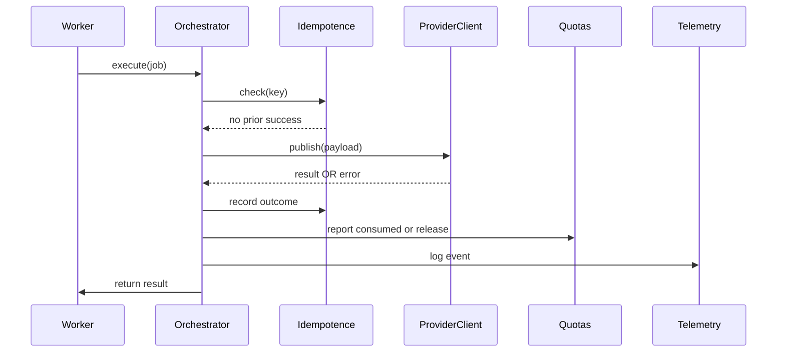

Voici **DOC-012 — Connectors Architecture Contract (Version longue, 10–16 pages)**, au format Markdown technique, adapté à Sparkmetriq S2/S3/S4, multi-tenant, SRE++, conforme DDIA, Observability Engineering, et Google SRE.

Ce document définit **le contrat officiel** pour tous les connecteurs sociaux :
Instagram, TikTok, Threads, Snapchat, Twitter/X, Facebook, Reddit, OnlyFans, etc.

→ À intégrer dans :

```
docs/architecture/DOC-012_connectors_architecture_contract.md
```

---

# 📘 **DOC-012 — Connectors Architecture Contract (Version longue)**

*Document Technique de Référence — Sparkmetriq Social Connectors / Reliability / Multi-Tenant / SRE++*

```markdown
---
title: DOC-012 — Connectors Architecture Contract
version: 1.0
status: Stable
category: Architecture / Connectors / Distributed Systems / SRE++
last_updated: 2025-02-05
---
```

---

# # **1. Objectif du document**

Chaque plateforme sociale (Instagram, TikTok, Threads, etc.) possède :

* APIs différentes,
* limitations inconnues ou strictes,
* erreurs fantômes,
* timeouts,
* comportements non documentés,
* rate limits imprévisibles.

Sparkmetriq doit garantir :

* **zéro double publication**,
* **zéro perte de job**,
* **zéro fuite cross-tenant**,
* **retry intelligents et conformes**,
* **idempotence totale**,
* **observabilité complète (DOC-006)**,
* **compatibilité avec la State Machine Quotas (DOC-004)**,
* **respect strict de la sécurité (DOC-008)**.

Ce document définit le **contrat unique et obligatoire** pour tous les connecteurs sociaux actuels et futurs.

---

# # **2. Périmètre**

S’applique à :

* Instagram Graph API
* TikTok Open API
* Threads API
* Snapchat Marketing API
* Facebook
* Reddit API
* Twitter/X
* OnlyFans (automation-specific)
* Et toute future intégration Sparkmetriq

Inclut :

* architecture du connector
* appels externes
* erreurs
* retries
* idempotence
* sécurisation des tokens
* logging et métriques
* isolation multi-tenant
* UI/admin-panel integration
* limites du scheduler/worker

---

# # **3. Architecture générale d’un connecteur**

```mermaid
flowchart LR
A[Celery Worker] --> B[Connector Orchestrator]
B --> C[Provider Client (Instagram/TikTok/Threads)]
C --> D[External API]
B --> E[Idempotence Registry]
B --> F[Quotas Service]
B --> G[Telemetry & Logs]
```

Chaque connecteur suit **strictement** les modules :

1. **Provider Client**
2. **Error Translator**
3. **Retry Controller**
4. **Idempotence Guard**
5. **Tenant Validator**
6. **Quotas Reporter**
7. **Telemetry Reporter (DOC-006)**

---

# # **4. Règles d’architecture (obligatoires)**

### ✔ **4.1. Tous les connecteurs sont purement I/O (pas de logique métier)**

Seul le service worker gère la logique Sparkmetriq.

### ✔ **4.2. Aucun connecteur ne stocke ou lit un token brut**

Le token est :

* récupéré via le service `ConnectorTokenService`
* stocké chiffré conformément à DOC-008
* jamais loggé

### ✔ **4.3. Un connecteur ne peut jamais changer l’état d’un quota**

Il ne peut que reporter :
`publish_success` ou `publish_failure`.

### ✔ **4.4. Tous les connecteurs doivent être idempotents**

Correspond à DOC-005.

### ✔ **4.5. Un connecteur ne doit jamais retry si effet externe possiblement déjà exécuté**

→ Vérification obligatoire du registre d’idempotence.

### ✔ **4.6. Multi-tenant enforced**

Tout connecteur doit vérifier :

```
job.org_id == token.org_id
```

---

# # **5. Provider Client Standard (obligatoire)**

Interface :

```python
class ProviderClient(Protocol):
    async def publish(self, payload: ProviderPayload) -> ProviderResult: ...
    async def get_rate_limit_status(self) -> RateLimitStatus: ...
```

Chaque connecteur implémente :

* `publish()`
* `upload_media()` si nécessaire
* `create_container_post()` pour Instagram
* `finalize()` pour TikTok
* `lookup_error()`

---

# # **6. Rate Limit Management**

Les plateformes imposent :

* 429 Too Many Requests
* 5xx overload
* throttling silencieux

Politique SRE++ Sparkmetriq :

## ✔ **6.1. Backoff exponentiel + jitter obligatoire**

```
1s → 2s → 4s → 8s → 16s (max)
```

## ✔ **6.2. Retry maximum = 3 fois**

Au-delà :
`connector_failure` mais jamais suppression du job.

## ✔ **6.3. Rate-Limit Buckets**

Chaque connecteur maintient :

```json
{
  "platform": "instagram",
  "org_id": "org_11",
  "remaining": 150,
  "reset_at": "2025-02-05T12:00:00Z"
}
```

L’UI peut l’afficher en option premium.

---

# # **7. Error Handling (obligatoire)**

Même structure pour toutes les erreurs externes :

```python
class ExternalError(BaseException):
    code: str
    message: str
    retryable: bool
    raw: dict
```

## 7.1. Erreurs catégorisées

| Catégorie           | Exemple           | Retry ? |
| ------------------- | ----------------- | ------- |
| **NetworkError**    | timeout, DNS      | ✔       |
| **RateLimitError**  | 429               | ✔       |
| **ServiceError**    | 500, 502          | ✔       |
| **PermissionError** | invalid token     | ❌       |
| **ValidationError** | payload incorrect | ❌       |
| **PlatformError**   | unsupported type  | ❌       |

---

## 7.2. Exemple Instagram

```json
{
  "error": {
    "type": "OAuthException",
    "code": 190,
    "message": "Invalid OAuth access token."
  }
}
```

→ Retryable = False.

---

## 7.3. Exemple TikTok

TikTok renvoie souvent :

```
error_code: 10000 (service busy)
```

→ Retryable = True.

---

# # **8. Idempotence (DOC-005 compliance)**

Chaque appel extern doit :

1. lire le registre d’idempotence
2. si résultat SUCCESS existe → ne rien réexécuter
3. si entrée PENDING → attendre
4. si FAILED → retry selon règle
5. écrire SUCCESS ou FAILED en fin de traitement

Clé idempotence :

```
f"{org_id}:{platform}:{account}:{content_hash}:{scheduled_at}"
```

---

# # **9. Workflow standard d’un connecteur**



---

# # **10. Multi-tenant Isolation (DOC-009)**

### Obligations :

* un token appartient à un seul tenant
* un worker d’un tenant ne publie pas pour un autre
* un connecteur ne peut pas accéder à un token d’un autre org_id
* un media uploadé doit être validé par ACL (DOC-010)

### Tenant Mismatch = CRITICAL ERROR

PR bloquée + red flag dans logs.

---

# # **11. Observability & Telemetry (DOC-006)**

Chaque connecteur doit logguer :

* `org_id`
* `platform`
* `account_id`
* `request_id`
* `idempotency_key`
* `duration_ms`
* `retry_count`
* `error.code`
* `rate_limit.remaining`

Exemple JSON :

```json
{
  "timestamp": "...",
  "service": "connector.instagram",
  "event": "external_call_success",
  "org_id": "org_55",
  "platform": "instagram",
  "duration_ms": 500,
  "retries": 1
}
```

---

# # **12. Security Contract (DOC-008 alignment)**

### Obligatoire :

* tokens chiffrés
* signed requests only
* jamais exposer token dans logs
* validation MIME stricte pour uploads
* never load external URLs not whitelisted

### Prohibitions :

* ❌ stocker un token en clair
* ❌ afficher un token dans UI
* ❌ envoyer un token au frontend

---

# # **13. Performance Guidelines (DOC-007 alignment)**

* I/O async obligatoire
* timeouts stricts 2–5s
* payload minimal
* compression image/video (via DOC-010)
* batching d’appels lorsque disponible (Instagram reels)

---

# # **14. Tests obligatoires**

## 14.1. Unit Tests

* simulate 429
* simulate 500
* simulate invalid token
* idempotence hit
* retry logic

## 14.2. Integration Tests

* publish flow complet
* publishing with retry
* external error translation

## 14.3. E2E Tests

* job scheduled → executed
* confirm no double publish
* tenant isolation

---

# # **15. CI/CD Compliance**

### 🚫 Bloquant :

* absence idempotence
* absence retry policy
* token visible dans logs
* tenant mismatch
* absence error translator
* absence signed URL
* absence provider abstraction

### ⚠ Warning :

* pas de métriques
* pas de logs structurés

---

# # **16. Checklist finale SRE++ Connectors**

* [ ] ProviderClient implémenté
* [ ] ErrorTranslator présent
* [ ] Retry policy conforme DOC-005
* [ ] Rate limit géré
* [ ] Tokens chiffrés et isolés
* [ ] Multi-tenant enforced
* [ ] ACL Media (DOC-010) utilisé
* [ ] Observability complète (DOC-006)
* [ ] aucune double publication possible
* [ ] CI/CD compliant
* [ ] tests E2E fonctionnels

---

# # **17. Conclusion**

DOC-012 définit le **contrat définitif et obligatoire** des connecteurs Sparkmetriq.
C’est le cœur de S2/S3/S4 :

* fiabilité,
* sécurité,
* bonne intégration plateformes,
* performance,
* observabilité,
* conformité multi-tenant.

> Toute violation de DOC-012 bloque la PR.
> Aucun connecteur n’est considéré "production ready" sans conformité totale.
---
