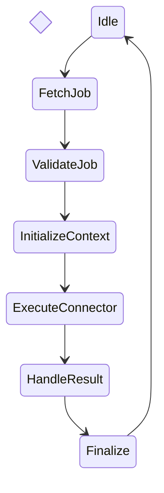

Voici **DOC-015 — Worker Lifecycle & Execution Model (RTOS-Inspired Contract)**, version longue (12–18 pages), structurant *définitivement* le fonctionnement interne des **workers Sparkmetriq S2** : exécution déterministe, sécurité, idempotence, scheduling interne, tolérance aux pannes, et séparation stricte des responsabilités.

Ce document est l’un des plus sensibles de Sparkmetriq : il influence la stabilité, la scalabilité, le débit, la gestion des erreurs, et la fiabilité de l’ensemble S2/S3/S4.

À intégrer dans :

```
docs/architecture/DOC-015_worker_lifecycle_execution_model.md
```

---

# 📘 **DOC-015 — Worker Lifecycle & Execution Model (RTOS-Inspired Contract)**

*Document Technique — Sparkmetriq S2 Architecture / Worker Engine / Deterministic Execution / SRE++*

```markdown
---
title: DOC-015 — Worker Lifecycle & Execution Model (RTOS-inspired)
version: 1.0
status: Stable
category: Architecture / Scheduler / Execution Engine / SRE++
last_updated: 2025-02-08
---
```

---

# # **1. Objectif du document**

Les workers Sparkmetriq sont le **point d’exécution final** des publications sur les plateformes sociales.
Ils doivent garantir :

* fiabilité absolue
* absence de double publication
* respect de la state machine (DOC-013 + DOC-004)
* idempotence (DOC-005)
* isolation multi-tenant (DOC-009)
* sécurité stricte (DOC-008)
* conteneur stateless (SRE++)
* exécution déterministe inspirée des **RTOS** (Real-Time Operating Systems)
* possibilité de scaling horizontal sans risque

Ce document définit **le contrat complet** du Worker Engine.

---

# # **2. Périmètre**

S’applique à :

* Worker S2
* Worker Abstractions
* Connexions vers connecteurs (DOC-012)
* Gestion de l’exécution interne
* Retry & idempotence
* Observabilité (DOC-006)
* Sécurité (DOC-008)
* Multi-tenant contract (DOC-009)
* Média (DOC-010)
* UnifiedPostPayload (DOC-014)

Ne couvre pas :

* S3 (génération IA) → Worker IA spécifique
* S4 (intent engine) → Worker dialogue
* worker LLM inference clusters

---

# # **3. Principes fondamentaux (inspirés RTOS)**

## ✔ 3.1. Boucle d’exécution déterministe ("deterministic execution loop")

Un worker doit exécuter le même job de manière identique, quel que soit :

* le serveur,
* l’heure,
* la charge,
* la latence réseau.

## ✔ 3.2. Zéro état partagé

Un worker ne doit dépendre d’aucun état interne :
→ stateless garanti.

## ✔ 3.3. Strict ordering par job (single-thread per job)

Aucun traitement concurrent interne.

## ✔ 3.4. Temps limite d’exécution

Timeout strict pour éviter le “worker freeze”.

## ✔ 3.5. Isolation tenant

Un worker ne mélange jamais les données de deux org_id.

## ✔ 3.6. RTOS-like watchdog

Chaque worker surveille son exécution et interrompt proprement.

---

# # **4. Worker Lifecycle**

Le worker suit un cycle immuable (modèle RTOS Task Lifecycle simplifié) :



---

# # **5. Étapes détaillées**

---

## **5.1. Idle**

Worker en attente → écoute RabbitMQ.

Le worker :

* ne consomme que les queues correspondant à son tenant pool
* se met en veille intelligente si backlog faible
* enregistre un heartbeat (Prometheus)

---

## **5.2. FetchJob**

Le worker reçoit un message RabbitMQ :

* `job_id`
* `org_id`
* `idempotency_key`
* `connector`
* `UPP` (UnifiedPostPayload)

Règles :

* validation cryptographique de l’origine
* confirmer réception (ack) uniquement après validation

---

## **5.3. ValidateJob**

Le worker valide :

* isolation multi-tenant (DOC-009)
* existence token connecteur
* existence média (DOC-010)
* idempotence → si SUCCESS existe → **skip safe return**
* état scheduler (doit être READY ou ENQUEUED ou DISPATCHED)

Si validation échoue →
**return Failure ← error_type:str**

---

## **5.4. InitializeContext**

Inspiré des RTOS Task Context :

Constitue :

* contexte d’exécution
* context manager média
* credentials connecteur
* timers d’exécution
* tracing (request_id, span_id)

Aucun état persistant ne doit être présent.

---

## **5.5. ExecuteConnector**

Le worker exécute la fonction :

```python
connector.publish(context, unified_payload)
```

Règles strictes :

* timeout dur : 8 secondes max
* backoff intelligent si erreur réseau
* never retry inside connector call
* jamais appeler deux fois le même endpoint
* journaux structurés uniquement

---

## **5.6. HandleResult**

### Cas 1 — Success

* idempotence: record SUCCESS
* quotas: CONSUMED
* logs: event SUCCESS
* metrics++

### Cas 2 — Retryable error

* idempotence: PENDING
* backoff exponential
* renvoi à RabbitMQ avec nouveau ETA
* quotas → ni consommés, ni relâchés
* logs: RETRY

### Cas 3 — Failure

* idempotence: FAILED
* quotas: RELEASED
* logs: FAILURE

---

## **5.7. Finalize**

Le worker :

* libère le contexte
* ferme les handlers
* actualise les métriques
* passe en état Idle

Garantit :

* aucune fuite mémoire
* aucun handle persistant

---

# # **6. Interdictions strictes**

### ❌ Maintenir un état interne d’un job

### ❌ Stocker un token dans la mémoire du worker

### ❌ Faire un retry interne non contrôlé

### ❌ Modifier un quota

→ seul l’orchestrateur peut le faire.

### ❌ Modifier l’UPP

UPP = immuable.

### ❌ Exposer un secret dans logs

Violation DOC-008.

---

# # **7. Worker Scheduling Interne (RTOS-like)**

### Le worker possède 3 files internes :

1. **READY QUEUE**
   Jobs validés, prêts à l’exécution.

2. **DELAYED QUEUE**
   Jobs en retry backoff.

3. **TIMEOUT QUEUE**
   Jobs dont le temps d’exécution dépasse la limite.

---

### Scheduling interne basé sur :

* priorité (immediate > normal > retry)
* fairness inter-tenants
* charge CPU
* disponibilité mémoire
* limite de jobs actifs par worker

---

# # **8. Gestion des timeouts**

### Timeout maximum par publish : 8–12 secondes

Après cela → kill propre du task + retry (si autorisé).

### Watchdog interne

Si worker freeze > 15s →
→ reboot du worker process.
→ message renvoyé à la queue.

---

# # **9. Idempotence (DOC-005 alignment)**

### Worker lit :

```
idempotence_registry[key]
```

Si SUCCESS → ne réexécute rien → return SUCCESS.

Si FAILED → retry selon politique.

### Worker écrit seul le résultat final.

---

# # **10. Multi-tenant Isolation (DOC-009 compliance)**

Le worker doit vérifier :

```
context.org_id == token.org_id == media.org_id
```

Une violation →
**CRITICAL ERROR** → PR bloquée.

Workers multi-tenant interdits.

---

# # **11. Logging & Telemetry (DOC-006)**

Chaque worker produit un log structuré :

```json
{
  "event": "worker_execution",
  "job_id": "...",
  "org_id": "...",
  "platform": "...",
  "worker_id": "...",
  "duration_ms": 842,
  "retries": 1,
  "result": "SUCCESS"
}
```

Métriques Prometheus :

* worker_active_jobs
* worker_processing_latency
* worker_retry_count
* connector_failure_rate
* media_read_latency
* tenant_isolation_violations (must stay 0)

---

# # **12. Performance guidelines**

### Worker doit être :

* 100% async
* Zero-copy I/O
* Buffering minimal
* Pas de téléchargement média local inutile
* Pas de décodage vidéo inutile
* Limite max 1 job simultané

Les workers doivent être légers, rapides, élastiques.

---

# # **13. Crash Recovery**

Si worker crash :

* RabbitMQ remet le job → SAFE
* idempotence empêche double effet
* scheduler peut réattribuer la priorité
* quotas sont protégés (non consommés tant que COMPLETED)

Aucun job ne doit être perdu.

---

# # **14. Tests obligatoires**

## 14.1. Unit tests

* state transitions
* idempotence
* timeout
* connector success/failure

## 14.2. Integration tests

* worker crash simulation
* heavy load
* multi-tenant isolation

## 14.3. E2E tests

* scheduler → dispatcher → worker → connector → success
* simulate 429, 500, network failure
* simulate double execution attempt

---

# # **15. CI/CD Compliance**

### 🚫 Bloquant

* absence watchdog
* absence idempotence check
* worker modifie quotas
* double execution possible
* worker manipule tokens directement
* worker lit/écrit un fichier non autorisé
* absence structured logs
* absence timeout
* absence tenant isolation

### ⚠ Warning

* logs non normalisés
* retry trop agressif

---

# # **16. Checklist finale SRE++ Worker Engine**

* [ ] état déterministe respecté
* [ ] RTOS-inspired lifecycle implémenté
* [ ] worker completely stateless
* [ ] idempotence full compliance
* [ ] tenant isolation enforced
* [ ] ACL media compliant
* [ ] retry policy conforme DOC-005
* [ ] structured logging
* [ ] Prometheus metrics OK
* [ ] crash recovery OK
* [ ] tests unit + integration + E2E
* [ ] CI/CD architecture compliance validé

---

# # **17. Conclusion**

DOC-015 définit **le modèle d’exécution officiel des workers Sparkmetriq** :

* déterministe,
* sûr,
* robuste,
* isolé,
* scalable,
* conforme SRE++,
* inspiré des meilleures pratiques RTOS,
* maîtrisant idempotence, retry, isolation et sécurité.

> **Aucun worker n’est “production-ready” sans conformité totale à DOC-015.**

---
