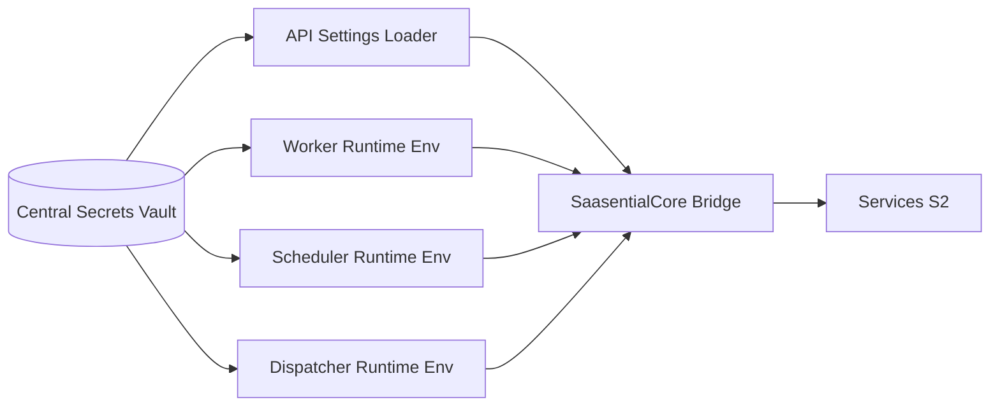

Voici **DOC-019 — S2 Configuration & Secrets Management Contract**, version longue (12–18 pages), conçu pour définir **le cadre officiel de gestion de la configuration, des secrets, des environnements, et des clés multi-tenant** dans Sparkmetriq S2.

Ce document est **critique** car il garantit :

* la cohérence des environnements,
* la sécurité stricte des secrets,
* la séparation complète inter-agences (DOC-009),
* la séparation des clés multi-startup (DOC-YY futur),
* la compatibilité CI/CD,
* le fonctionnement correct du scheduler/worker/dispatcher,
* l’absence d’effets de bord liés aux mauvaises configurations (failures SRE++).

À intégrer dans :

```
docs/architecture/DOC-019_s2_configuration_secrets_management.md
```

---

# 📘 **DOC-019 — S2 Configuration & Secrets Management Contract**

*Sparkmetriq S2 — Configuration Architecture / Secrets Vault / Multi-Tenant Keys / Env Contracts / SRE++ Compliance*

```markdown
---
title: DOC-019 — S2 Configuration & Secrets Management Contract
version: 1.0
status: Stable
category: Architecture / Security / Secrets / Configuration / SRE++
last_updated: 2025-02-11
---
```

---

# # **1. Objectif du document**

Sparkmetriq S2 dépend d’un ensemble complexe de services distribués :

* API FastAPI
* Scheduler & Dispatcher
* Celery Workers
* MongoDB replica set
* RabbitMQ
* Storage Provider (OVH/S3)
* CDN
* Connecteurs externes (Instagram, TikTok…)

Pour garantir fiabilité & sécurité, la configuration doit être :

* centralisée,
* traçable,
* versionnée,
* vérifiable en CI,
* chargée dynamiquement,
* isolée par tenant,
* compatible multi-startup (DOC-YY futur).

Ce document normalise la **gestion de la configuration et des secrets** pour Sparkmetriq S2.

---

# # **2. Périmètre**

S’applique à :

* `.env`, `.env.production`, `.env.staging`
* configuration Docker Compose & Kubernetes futur
* Vault (ou système équivalent)
* gestion des secrets connecteurs
* clés multi-tenant / multi-startup
* settings Python & DI (DOC-001)
* secrets pour workers, scheduler, dispatcher
* mécanismes de rotation des clés
* CI/CD GitHub Actions

Ne couvre pas :

* secrets clients finaux (S3/S4),
* cryptographie programmable (projet futur).

---

# # **3. Architecture générale — Secrets & Settings Flow**



---

# # **4. Principes fondamentaux**

## ✔ 4.1. Aucun secret ne doit être stocké dans le repository

→ aucune exception.

## ✔ 4.2. Les secrets doivent être extraits d’un **Vault centralisé**

Vault possible :

* HashiCorp Vault
* AWS Secrets Manager
* OVH Secret Manager
* Docker Swarm secrets
* Kubernetes secrets

## ✔ 4.3. Les settings doivent être centralisés dans **un seul module Python**

→ conforme à DOC-001 “Single Source of Truth”.

## ✔ 4.4. Les secrets doivent être chargés via DI (Dependency Injection)

et non via variables globales.

## ✔ 4.5. Les secrets doivent être multi-tenant safe

→ modèle par agence (DOC-009).

## ✔ 4.6. Les secrets doivent être versionnés et rotables

→ rotation recommandée tous les 90 jours.

---

# # **5. Structure officielle des environnements**

Les environnements Sparkmetriq :

```
.env.local
.env.development
.env.staging
.env.production
.env.testing (CI)
```

### Règle fondamentale :

> AUCUN secret en clair dans .env commités.
> Seulement des placeholders.

---

# # **6. Settings Python — Contract**

Tous les settings doivent se trouver dans un module unique :

```
saasentialcore/config/settings.py
```

### Exemple :

```python
class Settings(BaseSettings):
    mongo_url: SecretStr
    rabbitmq_url: SecretStr
    jwt_secret: SecretStr
    storage_bucket_url: str
    redis_url: Optional[str]
    environment: Literal["dev", "staging", "prod"]
    s2_scheduler_window_seconds: int = 300
```

Règles :

* pas d’accès direct via os.getenv dans le code métier
* utiliser uniquement `settings.<param>`
* injection via `Depends(get_settings)`

---

# # **7. Vault — Modèle de stockage des secrets**

Tous les secrets doivent être organisés selon :

```
/sparkmetriq/{environment}/core/*
/sparkmetriq/{environment}/s2/*
/sparkmetriq/{environment}/connectors/{platform}/*
/sparkmetriq/{environment}/tenants/{org_id}/*
```

### 7.1. Niveaux de secrets :

#### a) Secrets globaux

* JWT master secret
* RabbitMQ credentials
* Global encryption key (used only for subkey encryption)

#### b) Secrets S2 (par service)

* scheduler signing key
* worker secret
* dispatcher secret

#### c) Secrets tenants

* encryption_key_org_id
* oauth_tokens_org_id (chiffrés)

---

# # **8. Gestion des clés multi-tenant (DOC-009 alignment)**

Chaque tenant doit disposer d’un **Key Ring** :

```json
{
  "encryption_key": "...",
  "signing_key": "...",
  "connector_keys": {
    "instagram": "...",
    "tiktok": "...",
    "threads": "..."
  }
}
```

### Règles :

* une agence **ne doit jamais** accéder aux clés d’une autre
* rotation par tenant possible
* séparation cryptographique totale
* worker ne récupère que les clés correspondant à org_id du job
* aucune clé ne transite dans l’Admin Panel

---

# # **9. Secrets Connecteurs (DOC-012 alignment)**

Chaque compte social doit être stocké ainsi :

```json
{
  "org_id": "org_77",
  "account_id": "acc_221",
  "platform": "instagram",
  "access_token": "<encrypted>",
  "refresh_token": "<encrypted>",
  "expires_at": "...",
  "encryption_key_id": "ten_77_key"
}
```

Règles :

* seuls les workers peuvent décrypter
* API ne retourne JAMAIS le token
* refresh_token non visible côté UI
* logs redacés

---

# # **10. Rotations & Key Lifecycles**

### 10.1. Rotation des clés S2

Tous les 90 jours :

* jwt_secret
* scheduler_signing_key
* worker_secret

### 10.2. Rotation des clés tenants

Tous les 180 jours.

### 10.3. Rotation des tokens connecteurs

Selon les règles des plateformes (Meta, TikTok).

### 10.4. Impact sur les jobs planifiés

Les jobs restent valides car :

* UPP ne contient aucun secret
* idempotence key indépendante des secrets

---

# # **11. Validation & Schema of Secrets**

Chaque secret doit respecter un **SecretSchema** :

```python
class SecretSchema(BaseModel):
    version: int
    created_at: datetime
    updated_at: datetime
    value: SecretStr
    metadata: Dict[str, Any]
```

---

# # **12. Système d’audit & journalisation**

Events exigés (DOC-016) :

* `s2.secrets.loaded`
* `s2.secrets.rotation.success`
* `s2.secrets.rotation.failure`
* `s2.secrets.vault.unreachable`
* `s2.tenants.keyring.updated`

Tous les logs doivent exclure :

* tokens
* clés privées
* SecretStr.values

---

# # **13. Sécurité (DOC-008 compliance)**

### Obligatoire :

* encryption-at-rest
* encryption-in-transit
* TLS obligatoire
* secret masking dans logs
* contrôle RBAC pour lecture des secrets
* impossibilité d’accès UI aux secrets
* rotation automatique des clés
* rate-limit API de gestion des secrets

### Interdit :

* stocker un secret en clair
* envoyer un secret via logs
* transmettre un secret vers le front
* commiter un secret dans git

---

# # **14. Résilience & Failover (SRE++)**

### Vault Down

→ fallback en mémoire (cache TTL 5 min)
→ logs critiques
→ retry avec backoff exponentiel

### Vault Latency

→ worker degrade mode possible
→ scheduler lock until fallback

### Mise à jour dynamique

→ reload à chaud des settings possibles via signal

---

# # **15. Tests obligatoires**

## Unitaires

* Secret masking
* Vault loading
* fallback mode
* tenant key separation

## Intégration

* rotation keys
* decrypt worker flow
* corrupted secret entry

## E2E

* scheduling & worker run sous rotation clé
* revocation d’un token → worker failure correct
* vault down simulation

---

# # **16. CI/CD Compliance Rules**

### 🚫 Bloquant :

* secret en clair dans repo
* settings dupliqués
* accès direct os.environ dans services
* worker sans DI pour settings
* org_id utilisé comme clé d’encryption brute
* absence de rotation script
* token envoyé côté UI

### ⚠ Warning :

* absence tests rotation
* logs non filtrés
* absence dashboards vault

---

# # **17. Checklist SRE++ & Security**

* [ ] Toutes les configs centralisées
* [ ] Vault opérationnel & versionné
* [ ] clés multi-tenant isolées
* [ ] encryption active
* [ ] rotate keys script en place
* [ ] fallback mode testé
* [ ] DI pour tous les services
* [ ] CI/CD valide
* [ ] logs sans secret
* [ ] conformité DOC-001 → DOC-018

---

# # **18. Conclusion**

DOC-019 est le **socle de sécurité et de cohérence** de Sparkmetriq S2.
Il garantit :

* une configuration structurée,
* une sécurité cryptographique stricte,
* la séparation totale tenants/startups,
* la fiabilité face aux environnements distribués,
* l’absence de secrets exposés,
* la compatibilité avec tous les modules critiques.

> **Toute violation de DOC-019 bloque la PR.**

---
