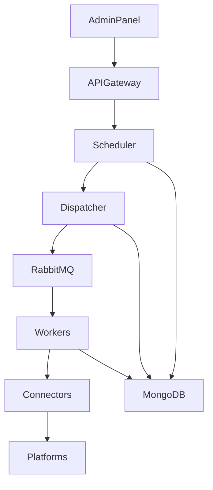

Voici **DOC-021 — S2 Monitoring Dashboards Contract (Grafana Templates + SRE Maps)**, version longue (12–18 pages), conçu pour définir **les dashboards officiels**, les métriques obligatoires, les SRE maps, les panels Grafana, les best practices d’observabilité, et les exigences opérationnelles pour Sparkmetriq S2.

Ce document complète :

* DOC-006 (Observability Contract)
* DOC-013 (Scheduler/Dispatcher Spec)
* DOC-015 (Worker Lifecycle)
* DOC-016 (Analytics & Reporting)
* DOC-017 (Reliability Playbook)

À intégrer dans :

```
docs/architecture/DOC-021_s2_monitoring_dashboards_contract.md
```

---

# 📘 **DOC-021 — S2 Monitoring Dashboards Contract**

*Sparkmetriq S2 — Observabilité Temps Réel, Grafana Templates, SRE Topology, Error Budgets*

```markdown
---
title: DOC-021 — S2 Monitoring Dashboards Contract
version: 1.0
status: Stable
category: SRE / Observability / Monitoring / Dashboards
last_updated: 2025-02-13
---
```

---

# # **1. Objectif du document**

Sparkmetriq S2 orchestre un système distribué :
scheduler → dispatcher → workers → connecteurs → plateformes externes → analytics.

Pour garantir **qualité**, **fiabilité** et **scalabilité**, le monitoring doit :

* représenter fidèlement l’état du système,
* permettre d’anticiper les pannes,
* refléter les SLIs / SLOs,
* fournir des visualisations utiles aux équipes internes,
* offrir des dashboards isolés par tenant et multi-tenant global,
* soutenir les investigations incident (DOC-017),
* s’intégrer dans l’architecture SRE++.

DOC-021 définit les dashboards officiels Grafana à maintenir.

---

# # **2. Périmètre**

S’applique à :

* Grafana
* Prometheus
* Loki (logs)
* API metrics endpoints
* Dashboards Admin Panel
* alertes SRE
* SRE maps / dependency graphs
* Multi-tenant monitoring

---

# # **3. Architecture Monitoring**

```mermaid
flowchart LR
A[API Metrics] --> P[Prometheus]
B[Scheduler Metrics] --> P
C[Workers Metrics] --> P
D[Connectors Metrics] --> P
E[Gateway Metrics] --> P

Logs --> Loki

P --> G[Grafana Dashboards]
Loki --> G
Analytics DB --> G
```

---

# # **4. Obligations fondamentales**

## ✔ 4.1. Chaque service **expose des métriques Prometheus**

Conforme à DOC-006.

## ✔ 4.2. Chaque événement critique doit produire un log structuré

Utilisé par Grafana + Loki.

## ✔ 4.3. Aucun dashboard ne doit dépendre de logs non structurés.

## ✔ 4.4. Les dashboards doivent inclure :

* indicateurs temps réel
* historiques
* taux de succès / échec
* heatmaps
* breakdown par plateforme, worker, tenant

## ✔ 4.5. Multi-tenant enforced

Un tenant ne peut jamais voir les données d’un autre.

---

# # **5. Dashboards officiels S2**

## **5.1. Dashboard 1 — S2 System Overview**

Le dashboard principal contenant :

### Panels :

* Scheduler latency (P50/P95/P99)
* Worker execution latency
* Job throughput (per minute)
* Ready queue length
* Dispatcher enqueued count
* Rate-limit errors per platform
* Failure rate (global)
* Retry rate
* Active workers

### Visualisations recommandées :

* Graphs multi-séries
* Heatmap horaire
* SingleStat “Global Success Rate Today”
* Alert banner: “Platform Outage Detector”

---

## **5.2. Dashboard 2 — Scheduler Internals**

Affiche l’état interne (DOC-013) :

* scheduled_jobs_total
* ready_jobs_total
* scheduling_window_utilization
* batch_size_distribution
* job_priority_distribution
* state transition lag
* scheduler_decision_latency_seconds

### Panels critiques :

* “READY queue > threshold”
* “Scheduler not producing batches”

---

## **5.3. Dashboard 3 — Worker Execution (RTOS-inspired)**

Basé sur DOC-015.

### Panels :

* worker_active_jobs
* worker_execution_latency_seconds (P50/P95/P99)
* worker_retry_total
* worker_timeout_total
* worker_crash_total
* worker_memory_usage
* worker_cpu_seconds_total

### SRE Maps :

Graphique reliant :
worker → connector → platform → success/failure.

---

## **5.4. Dashboard 4 — Connectors Health (DOC-012)**

### Panels :

* connector_api_latency_seconds (par plateforme)
* connector_api_errors_total
* connector_rate_limit_hits
* success vs failure trends
* error codes breakdown
* commit latency per platform (TikTok, IG, Threads)

### Multi-séries :

Comparaison TikTok vs Instagram vs Threads.

---

## **5.5. Dashboard 5 — API Gateway & Rate Limiting (DOC-018)**

### Metrics :

* gateway_request_total
* gateway_rate_limit_hits_total
* gateway_latency_seconds
* gateway_tenant_rl_exceeded_total
* circuit_breaker_active

### Visualisation :

* “Tenant Hotspots” → bar chart
* “Rate Limit Fairness Score”

---

## **5.6. Dashboard 6 — Quotas & Tenant Usage**

### Metrics :

* quotas_reserved_total
* quotas_consumed_total
* quotas_released_total
* quotas_exceeded_total

### Panels :

* usage per tenant
* daily quota projection
* risk of quota exhaustion
* over-quota events detections

---

## **5.7. Dashboard 7 — Media Pipeline (DOC-020)**

### Metrics :

* media_preprocessing_latency
* media_transcoding_failures
* media_upload_throughput
* cdn_delivery_latency

### Panels :

* “Video Transcoding Time Distribution”
* “Image Optimization Success Rate”

---

## **5.8. Dashboard 8 — Multi-Tenant Insights (DOC-009)**

Masqué dans Admin Panel sauf superadmin.

### Panels :

* usage by tenant
* processing time by tenant
* error rate by tenant
* SLA heatmap

---

## **5.9. Dashboard 9 — Reliability SLO Dashboard (DOC-017)**

Les SLOs officiels :

### Panels :

* publish_success_rate
* end_to_end_latency
* retry_rate
* error_rate per platform
* platform error budget burn rate
* availability gauge

---

# # **6. Alerting Rules (SRE++)**

## 6.1. Alerte Critique — “No workers active”

Condition :

```
worker_active_jobs == 0 for 30s
```

## 6.2. Alerte Critique — “Scheduler blackout”

```
scheduler_batch_count == 0 for 20s
```

## 6.3. Alerte Critique — “Duplicate publish risk”

→ violation idempotence

## 6.4. Alerte Majeure — “Connector latency explosion”

```
P95 > 3s for 60s
```

## 6.5. Alerte Majeure — “Rate-limit storm”

```
connector_rate_limit_hits > threshold
```

## 6.6. Alerte Majeure — “Gateway RL exhaustion”

```
gateway_tenant_rl_exceeded_total > threshold
```

## 6.7. Alerte Mineure — “High Worker Retry Rate”

```
retry_rate > 5%
```

---

# # **7. SRE Maps — Architecture Graphs**

SRE Maps = visualisation des dépendances :

### Example Graph



Les SRE maps doivent :

* être visibles dans Grafana
* aider au debug d’incidents
* s’aligner avec DOC-013 et DOC-017

---

# # **8. Multi-tenant Compliance**

Un dashboard doit toujours :

* filtrer les métriques par org_id
* masquer les autres tenants
* isoler les logs par tenant
* stocker seulement des métadonnées anonymisées

Le superadmin Dashboard doit contenir un commutateur
**tenant → système complet**.

---

# # **9. Tests obligatoires**

## Unit

* validation des métriques exposées
* format Prometheus
* nommage SRE-compliant

## Integration

* dashboard loads without errors
* data sources operational
* multi-tenant filters

## E2E

* charge modérée → dashboards stables
* crash test scheduler → SRE maps reflètent l’état réel

---

# # **10. CI/CD Compliance**

### 🚫 Bloquant :

* metrics non exposées par un service
* metrics duplicées
* absence de labels org_id
* dashboard brisé (erreur grafana JSON)
* absence d’alertes critiques
* logs non structurés

### ⚠ Warning :

* dashboard trop lent
* panels sans description
* absence heatmaps

---

# # **11. Checklist SRE++ Dashboards**

* [ ] 9 dashboards officiels déployés
* [ ] SLO Dashboard opérationnel
* [ ] SRE maps complètes
* [ ] aucun tenant leak
* [ ] alertes critiques opérationnelles
* [ ] logs & metrics corrélés
* [ ] dashboards testés en conditions de panne
* [ ] conformité DOC-006 / DOC-017
* [ ] CI/CD valide

---

# # **12. Conclusion**

DOC-021 établit **le contrat officiel des dashboards S2**, éléments cruciaux pour :

* opérer Sparkmetriq en production,
* atteindre les SLOs,
* diagnostiquer les pannes,
* valider les performances,
* maintenir la qualité,
* garantir la transparence opérationnelle.

> Toute PR supprimant, cassant ou dégradant les métriques / dashboards définis dans DOC-021 doit être bloquée.

---
