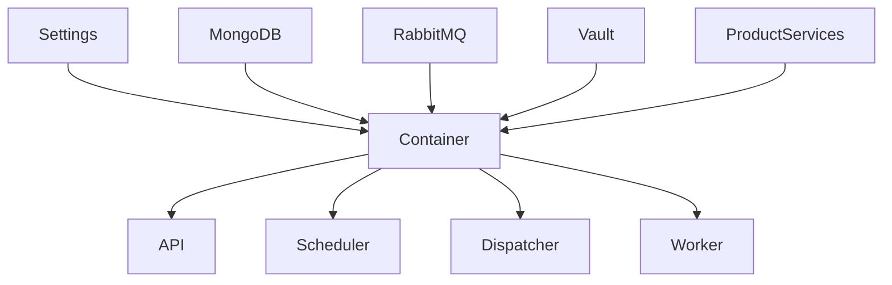

Parfait.
Je génère maintenant :

# ✅ **DOC-SC-003 — Core Dependency Injection & Service Container Contract**

*(version longue, clean, cohérente avec DOC-SC-001 et DOC-SC-002, SRE++ & multi-startup-ready)*

À placer dans :

```
docs/saasentialcore/architecture/DOC-SC-003_core_dependency_injection_container_contract.md
```

---

# 📘 `DOC-SC-003_core_dependency_injection_container_contract.md`

````markdown
---
title: DOC-SC-003 — Core Dependency Injection & Service Container Contract
version: 1.0
status: Stable
category: SaasentialCore / Dependency Injection / Service Container
last_updated: 2025-02-14
---

# 1. Objectif du document

DOC-SC-003 définit :

- le système d’injection de dépendances (DI) centralisé de SaasentialCore,
- le contrat du Service Container,
- les règles d’enregistrement des services Core & Produits,
- les mécanismes d’injection pour FastAPI, Workers, Scheduler, Dispatcher,
- les invariants garantissant sécurité, stabilité et isolation multi-startup.

Ce document complète :

- DOC-SC-001 (Architecture Workspace),
- DOC-SC-002 (Product Registration),
- DOC-001 (DI Contract Sparkmetriq),
- DOC-019 (Settings & Secrets).

SaasentialCore doit fournir **un DI unifié** pour l’ensemble du monorepo.

---

# 2. Principes fondamentaux

## ✔ 2.1. Single Source of Truth  
Un **unique container** gère **toutes les dépendances**.

## ✔ 2.2. Pas d’utilisation directe de global variables  
Toutes les dépendances runtime doivent passer par :

- le container,
- FastAPI Depends(),
- les providers SaasentialCore.

## ✔ 2.3. Injection obligatoire  
Aucun service ne doit être instancié en dur.  
Exemple interdit :

```python
QuotaService()
MongoClient("mongodb://localhost:27017")
````

## ✔ 2.4. Isolation multi-startup

Le container doit être **agnostique produit** et séparer :

* ressources globales,
* ressources produit,
* ressources tenant.

## ✔ 2.5. Compatibilité multi-runtimes

Le container doit fonctionner en :

* FastAPI,
* Celery worker,
* Scheduler,
* Dispatcher,
* CLI / scripts maintenance.

---

# 3. Architecture du DI Container



---

# 4. Structure du container SaasentialCore

À placer dans :

```
saasentialcore/di/container.py
```

### Exemple :

```python
class Container:
    def __init__(self, settings: Settings):
        self.settings = settings
        self._providers = {}

    def register(self, name: str, provider: Callable):
        self._providers[name] = provider

    def resolve(self, name: str):
        if name not in self._providers:
            raise KeyError(f"Provider '{name}' not registered")
        return self._providers[name]()
```

Le container est :

* **singleton par process**,
* non mutable en runtime,
* testé avant exécution.

---

# 5. Providers Core obligatoires

Les providers suivants doivent exister dans SaasentialCore.

## 5.1. Settings Provider

```python
container.register("settings", lambda: Settings())
```

## 5.2. MongoDB Provider

```python
container.register("db", lambda: MongoClient(settings.mongo_url.get_secret_value()))
```

## 5.3. RabbitMQ Provider

```python
container.register("broker", lambda: make_rabbitmq_connection(settings.rabbitmq_url.get_secret_value()))
```

## 5.4. Vault Provider

```python
container.register("vault", lambda: VaultClient(settings.vault_url))
```

## 5.5. Logger Provider

```python
container.register("logger", lambda: get_structured_logger("saasentialcore"))
```

---

# 6. Registration des produits (aligné avec DOC-SC-002)

Lorsqu’un produit est validé :

```python
for product in registry.enabled_products():
    module = import_module(product.entrypoint)
    module.register_services(container)
```

Chaque produit doit définir un fichier :

```
products/<product>/di.py
```

Avec :

```python
def register_services(container):
    container.register("sparkmetriq.scheduler", lambda: SchedulerService(container.resolve("db")))
    container.register("sparkmetriq.dispatcher", lambda: DispatcherService(...))
```

### Règle :

> Un service produit doit toujours être enregistré sous un nom unique `product_id.service_name`.

---

# 7. Injection dans FastAPI

Toutes les routes utilisent :

```python
def get_container():
    return global_container

def get_service(name: str):
    return global_container.resolve(name)
```

Exemple :

```python
@router.post("/schedule")
def schedule(payload: UnifiedPostPayload,
             scheduler=Depends(lambda: get_service("sparkmetriq.scheduler"))):
    return scheduler.schedule(payload)
```

### Règles obligatoires :

* aucune instanciation directe dans les routes,
* aucun paramètre runtime hors DI,
* testability garantie via overrides.

---

# 8. Injection dans les Workers (Celery)

Workers doivent charger le container **avant** d’exécuter une tâche :

```python
def worker_bootstrap():
    global container
    settings = Settings()
    container = Container(settings)
    product_registry.load_products(container)
```

Dans la tâche :

```python
@celery_app.task
def run_job(job_id):
    worker = container.resolve("sparkmetriq.worker")
    return worker.execute(job_id)
```

---

# 9. Injection dans Scheduler & Dispatcher

Ces composants doivent utiliser exactement le même mécanisme que les workers :

* init du container,
* registration core,
* registration produits.

### Interdit :

* scheduler ne peut pas instancier directement une DB,
* dispatcher ne peut pas lire un secret hors provider.

---

# 10. Scope des dépendances

## 10.1. Singleton

Par défaut :

* settings
* db client
* broker client
* vault client
* product services stateful

## 10.2. Transient

Pour services purement stateless :

```python
container.register("now", lambda: datetime.utcnow())
```

---

# 11. Anti-patterns interdits

### ❌ Instanciation directe dans produits :

```python
client = MongoClient(...)
```

### ❌ Instanciation dans API :

```python
service = SchedulerService()   # interdit
```

### ❌ Passage manuel des settings :

```python
SchedulerService(settings)  # non, doit passer via container
```

### ❌ DI cachée dans les modules :

```python
GLOBAL_DB = MongoClient(...)
```

---

# 12. Tests & Overrides

Les tests doivent pouvoir remplacer n’importe quel provider :

```python
def test_scheduler():
    container.register("db", lambda: FakeDB())
    scheduler = container.resolve("sparkmetriq.scheduler")
    ...
```

E2E :

* container réinitialisé entre tests,
* DB en mémoire,
* produits activés/désactivés via manifest test.

---

# 13. CI/CD Compliance Rules

### 🚫 Bloquant :

* usage direct de `MongoClient`, `Redis`, `RabbitMQ` hors providers,
* instanciation de services produits sans DI,
* absence de `register_services()` dans un produit,
* collision de noms de providers,
* container mutable en runtime.

### ⚠ Warning :

* trop de providers transients,
* pas de tests DI pour un produit.

---

# 14. Invariants non négociables

1. Toute dépendance passe par le container.
2. Aucun service Core ou produit ne doit dépendre de globales.
3. Un test doit toujours pouvoir remplacer un provider.
4. Un produit doit s’enregistrer entièrement via DI.
5. Le container est unique et stable.

---

# 15. Conclusion

DOC-SC-003 définit la fondation DI du monorepo multi-startup :

* DI unifiée,
* container centralisé,
* isolation produit,
* injection compatible API / Scheduler / Worker,
* conformité SRE++ et testabilité élevée.

**Toute PR violant DOC-SC-003 doit être bloquée.**

```
# DOC-SC-003_core_dependency_injection_container_contract.md
