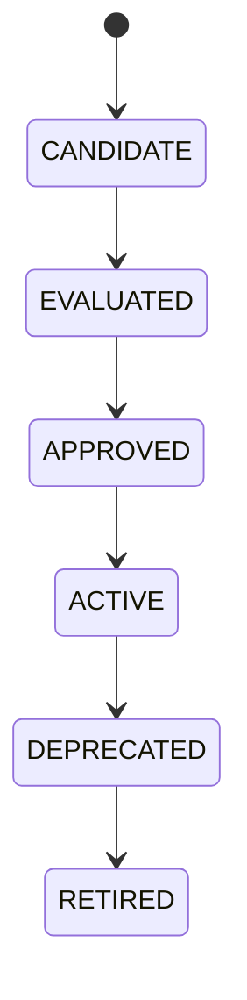

Voici **DOC-SC-022 — AI Governance & Model Registry Contract**,
version **longue**, normative, **transverse à toutes les startups et produits**, indépendante de tout fournisseur, et pleinement alignée avec **SC-001 → SC-021**, SRE++, sécurité, observabilité et exploitation multi-tenant.

Ce document fixe **la gouvernance IA de SaasentialCore** :
qui peut utiliser quels modèles, comment ils sont déclarés, versionnés, évalués, monitorés, remplacés et retirés — **sans jamais casser la production**.

À placer dans :

```
docs/saasentialcore/architecture/DOC-SC-022_ai_governance_model_registry_contract.md
```

---

# 📘 `DOC-SC-022_ai_governance_model_registry_contract.md`

```markdown
---
title: DOC-SC-022 — AI Governance & Model Registry Contract
version: 1.0
status: Stable
category: SaasentialCore / AI / Governance / Model Registry / Risk Control
last_updated: 2025-02-18
---

# 1. Objectif du document

DOC-SC-022 définit le **contrat officiel de gouvernance IA** pour SaasentialCore.

Il formalise :
- la **déclaration et l’enregistrement des modèles IA**,
- la **gestion multi-modèles / multi-fournisseurs**,
- le **versioning, l’activation et la désactivation**,
- les **droits d’usage par startup / produit / tenant**,
- le **contrôle des risques (coût, sécurité, dérive)**,
- la **traçabilité complète des décisions IA**,
- la **compatibilité avec l’observabilité, la conformité et la fiabilité**.

Ce document garantit que **l’IA est un composant gouverné**, pas un appel sauvage.

---

# 2. Principes fondamentaux (Non négociables)

## ✔ 2.1. Aucun modèle sans registry  
Tout modèle utilisé en production **doit être enregistré**.

## ✔ 2.2. Modèle ≠ Provider  
Le système gouverne des **modèles logiques**, pas des APIs.

## ✔ 2.3. Usage contrôlé, pas implicite  
L’usage d’un modèle est **explicitement autorisé**, jamais implicite.

## ✔ 2.4. Multi-startup first-class  
Chaque startup peut :
- autoriser,
- restreindre,
- bannir
des modèles spécifiques.

## ✔ 2.5. Observabilité obligatoire  
Chaque appel IA est mesuré, attribué, traçable.

---

# 3. Définitions clés

| Terme | Définition |
|----|-----------|
| Model | Un modèle IA logique (ex: `llama-70b-chat`) |
| Provider | Fournisseur technique (OpenAI, Mistral, on-prem) |
| Model Version | Version immuable du modèle |
| Model Alias | Nom stable pointant vers une version |
| Registry | Catalogue central des modèles |
| Policy | Règle d’usage |
| Capability | Ce que le modèle sait faire |

---

# 4. Architecture du Model Registry

```

AI Registry
├── Models
│    ├── model_id
│    │    ├── versions
│    │    ├── metadata
│    │    ├── capabilities
│    │    ├── limits
│    │    └── status
├── Policies
├── Evaluations
└── Audit Logs

````

Le registry est **central, immuable, versionné**.

---

# 5. Déclaration d’un modèle (obligatoire)

Tout modèle doit être déclaré via un **manifest officiel** :

```json
{
  "model_id": "llama-70b-chat",
  "provider": "meta",
  "modality": ["text"],
  "capabilities": ["chat", "reasoning"],
  "context_window": 8192,
  "max_output_tokens": 2048,
  "estimated_cost_per_1k_tokens": 0.0,
  "hosting": "on-prem",
  "status": "candidate"
}
````

### Champs obligatoires :

* `model_id`
* `provider`
* `modality`
* `capabilities`
* `limits`
* `hosting`
* `status`

---

# 6. Cycle de vie d’un modèle



### Règles :

* **ACTIVE** = utilisable en production
* **DEPRECATED** = existant mais non recommandé
* **RETIRED** = usage interdit

---

# 7. Versioning des modèles

## 7.1. Version immuable

Une version de modèle :

* ne change jamais,
* est identifiée (`model_id@version`),
* est auditée.

Exemple :

```
llama-70b-chat@1.0.0
```

---

## 7.2. Alias logique

Les produits consomment **un alias**, jamais une version brute :

```
chat.default → llama-70b-chat@1.0.0
```

Permet :

* hot-swap sans code change,
* rollback immédiat.

---

# 8. Policies d’usage (AI Policy Engine)

## 8.1. Scopes possibles

Une policy peut restreindre par :

* startup
* organisation
* produit
* rôle utilisateur
* capacité (ex: génération d’image interdite)
* coût max
* volume max

---

## 8.2. Exemple de policy

```json
{
  "policy_id": "prod_chat_policy",
  "allowed_models": ["chat.default"],
  "max_tokens_per_day": 5_000_000,
  "max_cost_per_month": 500,
  "allowed_capabilities": ["chat"],
  "blocked_content": ["pii", "medical"]
}
```

Violation → **rejet inference**.

---

# 9. Sélection de modèle (Runtime)

La sélection suit l’ordre :

1. Policy validation
2. Alias resolution
3. Capacity & quota check
4. Health check modèle
5. Execution

Le code produit **ne choisit jamais directement un modèle**.

---

# 10. Évaluation & Qualité des modèles

Chaque modèle doit avoir :

* benchmark interne
* métriques qualité
* métriques latence
* métriques coût
* métriques erreurs

Résultats stockés dans le registry.

---

# 11. Observabilité IA (liaison DOC-SC-020 / 021)

Chaque inference génère :

```json
{
  "event": "ai.model.used",
  "model_id": "llama-70b-chat",
  "model_version": "1.0.0",
  "alias": "chat.default",
  "startup_id": "...",
  "org_id": "...",
  "product_id": "...",
  "tokens_in": 1024,
  "tokens_out": 256,
  "latency_ms": 820,
  "estimated_cost": 0.00
}
```

Jamais :

* prompt brut
* output brut

---

# 12. Sécurité & conformité

## Interdictions absolues

* modèle non enregistré
* modèle en statut ≠ ACTIVE
* appel direct provider
* bypass registry
* hardcode modèle dans produit

---

## Conformité

* audit complet des usages
* traçabilité décisions IA
* support exigences clients enterprise

---

# 13. Décommissionnement & Rollback

## Décommissionnement

* passage DEPRECATED
* migration progressive
* monitoring erreurs
* passage RETIRED

## Rollback

* alias switch
* immédiat
* sans redéploiement

---

# 14. Multi-tenant isolation

* policies isolées par startup
* quotas isolés
* métriques isolées
* aucun partage implicite

---

# 15. CI/CD Compliance Rules

### 🚫 Bloquant

* modèle non déclaré
* usage direct provider
* absence policy
* absence alias
* absence observabilité
* modèle actif sans évaluation
* modèle retiré encore utilisé

### ⚠ Warning

* absence benchmark
* absence coût estimé
* absence tests fallback

---

# 16. Invariants non négociables

1. Aucun modèle sans registry.
2. Aucun appel IA hors gouvernance.
3. Aucun modèle sans policy.
4. Aucun modèle sans observabilité.
5. Aucun modèle sans rollback.
6. Toute PR violant DOC-SC-022 est bloquée.

---

# 17. Conclusion

DOC-SC-022 fait passer l’IA de **feature expérimentale** à **infrastructure gouvernée**.

Il permet :

* intégration multi-LLM propre,
* maîtrise des coûts,
* réduction des risques,
* auditabilité enterprise,
* évolution continue sans rupture,
* industrialisation réelle de l’IA.

C’est le **socle de confiance IA** de SaasentialCore.
