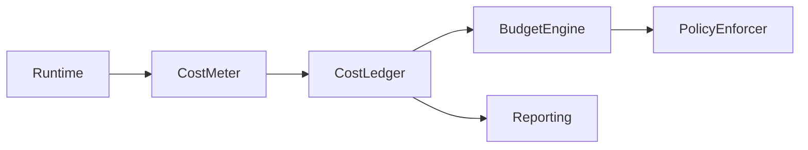

Voici **DOC-SC-023 — Cost Control & FinOps Contract (Infrastructure, AI, Multi-Tenant)**,
version **longue**, normative, **orientée maîtrise financière en production**, et strictement alignée avec **SC-001 → SC-022**, SRE++, AI governance et exploitation multi-startup.

Ce document fixe **le cadre FinOps obligatoire** :
👉 *aucun service ne peut consommer des ressources sans visibilité, limite et responsabilité financière.*

À placer dans :

```
docs/saasentialcore/architecture/DOC-SC-023_cost_control_finops_contract.md
```

---

# 📘 `DOC-SC-023_cost_control_finops_contract.md`

````markdown
---
title: DOC-SC-023 — Cost Control & FinOps Contract
version: 1.0
status: Stable
category: SaasentialCore / FinOps / Cost Control / AI / Infrastructure
last_updated: 2025-02-18
---

# 1. Objectif du document

DOC-SC-023 définit le **contrat officiel de contrôle des coûts et de gouvernance FinOps** pour SaasentialCore et l’ensemble des produits et startups qui l’utilisent.

Il garantit que :
- chaque ressource consommée est **attribuable**,
- chaque coût est **prévisible**,
- chaque dérive est **détectée tôt**,
- chaque dépassement est **bloqué ou dégradé proprement**,
- aucune startup ne peut impacter financièrement les autres.

Ce document est **obligatoire pour toute exploitation en production**.

---

# 2. Principes fondamentaux (non négociables)

## ✔ 2.1. No Cost Without Context  
Aucune consommation sans :
- startup_id
- org_id
- product_id
- service_id

## ✔ 2.2. Cost ≠ Billing  
Le contrôle des coûts est **technique et temps réel**, indépendamment de la facturation commerciale.

## ✔ 2.3. Budget First-Class  
Tout usage significatif doit être rattaché à :
- un budget,
- une limite,
- une politique de dépassement.

## ✔ 2.4. Dégradation > Explosion  
En cas de dépassement :
> on dégrade, on limite, on bloque — **on ne crashe jamais**.

---

# 3. Périmètre des coûts surveillés

## 3.1. Infrastructure

- CPU
- Mémoire
- Disque
- Réseau
- Stockage objet
- CDN
- Message broker
- Databases

## 3.2. Exécution applicative

- Workers S2
- Scheduler / Dispatcher
- API Gateway
- Background tasks

## 3.3. IA / Inference (critique)

- tokens LLM
- inference time
- GPU time
- batch jobs
- embeddings
- fine-tuning

---

# 4. Cost Attribution Model (obligatoire)

Chaque unité de coût doit être taggée :

```json
{
  "startup_id": "stp_1",
  "org_id": "org_22",
  "product_id": "sparkmetriq",
  "service": "ai_inference",
  "resource": "tokens",
  "trace_id": "..."
}
````

### Interdiction absolue :

* coûts non attribués
* coûts globaux non ventilés

---

# 5. Architecture FinOps cible



### Composants :

| Composant      | Rôle                 |
| -------------- | -------------------- |
| CostMeter      | mesure fine          |
| CostLedger     | stockage append-only |
| BudgetEngine   | comparaison budget   |
| PolicyEnforcer | actions runtime      |
| Reporting      | dashboards / exports |

---

# 6. Cost Metering (temps réel)

## 6.1. Infrastructure

* CPU-seconds
* Memory-seconds
* IO ops
* Network bytes

Mesure agrégée par service + tenant.

---

## 6.2. IA / LLM

Mesures obligatoires :

* tokens_in
* tokens_out
* inference_duration
* model_id
* estimated_cost

Aligné DOC-SC-020 / 022.

---

# 7. Cost Ledger (source de vérité)

## 7.1. Propriétés

* append-only
* immutable
* horodaté
* replayable
* multi-tenant partitionné

Exemple :

```json
{
  "timestamp": "2025-02-18T12:00:01Z",
  "startup_id": "stp_1",
  "org_id": "org_22",
  "product_id": "sparkmetriq",
  "service": "ai_inference",
  "cost_unit": "tokens",
  "quantity": 1536,
  "estimated_cost": 0.0123
}
```

---

# 8. Budgets & Quotas financiers

## 8.1. Niveaux de budget

| Niveau       | Exemple      |
| ------------ | ------------ |
| Startup      | 5 000 €/mois |
| Organisation | 500 €/mois   |
| Produit      | 300 €/mois   |
| Service      | 100 €/mois   |
| Modèle IA    | 50 €/mois    |

Budgets hiérarchiques et cumulés.

---

## 8.2. Types de budgets

* mensuel
* journalier
* rolling window
* par modèle
* par capacité

---

# 9. Policy Enforcement (runtime)

Lorsque seuil atteint :

| Seuil | Action             |
| ----- | ------------------ |
| 70%   | warning            |
| 85%   | throttling         |
| 95%   | hard limit         |
| 100%  | blocage / fallback |

Exemples :

* réduire concurrency
* basculer modèle IA moins cher
* bloquer inference non critique
* désactiver batch jobs

---

# 10. Intégration avec Scheduler & Workers

## Scheduler

* refuse jobs non critiques si budget dépassé
* priorise jobs essentiels

## Workers

* refusent inference hors budget
* appliquent timeout agressif
* remontent cost events

---

# 11. Intégration AI Governance (DOC-SC-022)

Le BudgetEngine peut :

* désactiver un alias modèle
* forcer un fallback
* limiter tokens max
* refuser certaines capacités

Sans redéploiement.

---

# 12. Observabilité FinOps

## Metrics obligatoires

* `cost_estimated_total`
* `cost_by_startup`
* `cost_by_product`
* `cost_by_model`
* `budget_utilization_ratio`

---

## Logs

```json
{
  "event": "budget.threshold",
  "level": "WARNING",
  "startup_id": "...",
  "product_id": "...",
  "ratio": 0.87,
  "trace_id": "..."
}
```

---

# 13. Dashboards FinOps (liaison DOC-SC-021)

Dashboards requis :

* Cost Overview
* AI Cost Breakdown
* Budget vs Actual
* Cost by Tenant
* Cost by Model
* Cost Anomalies

---

# 14. Anomaly Detection

Détection automatique :

* spike soudain
* dérive lente
* usage hors pattern
* modèle devenu coûteux

Anomalie → alert + throttling.

---

# 15. Tests & Simulation

Tests obligatoires :

* dépassement budget
* fallback modèle
* blocage inference
* replay ledger
* stress multi-tenant

---

# 16. CI/CD Compliance Rules

### 🚫 Bloquant

* service sans cost metering
* inference sans coût estimé
* budget non défini
* coût non attribué
* dépassement sans policy
* suppression ledger

### ⚠ Warning

* absence dashboards coûts
* absence alertes
* absence tests dépassement

---

# 17. Invariants non négociables

1. Aucun coût sans attribution.
2. Aucun dépassement silencieux.
3. Aucun service hors budget.
4. Aucune IA sans limite financière.
5. Toute dérive est détectée.
6. Toute PR violant DOC-SC-023 est bloquée.

---

# 18. Conclusion

DOC-SC-023 transforme la gestion des coûts en **système de contrôle actif**, pas en reporting passif.

Il permet :

* maîtrise financière multi-startup,
* exploitation IA durable,
* prévention des dérives,
* confiance investisseurs & clients,
* passage à l’échelle sans surprise.

C’est le **socle FinOps** de SaasentialCore.

```

---

## ✅ DOC-SC-023 est finalisé.
